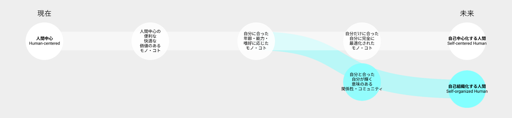

# Vision 1: 人間と人間

利用者の便利さ、快適さ、人間中心設計を突き詰めた先に、最上の満足と豊かさが待っているのか？

## 現在の価値観の延伸によるビジョン：自己中心化する人間

- 技術が、異なる人間1人1人それぞれのニーズを高速に、高精度に、最適に処理する
- 利用者個人の満足、自助的な体験が重視される
- 個人個人の多様なニーズを個別に満たす
- 自分が最高の体験を享受するため、最高でない体験（待ちや競争、資源利用）も我慢しなければならない

## 工学研究科が思い描く別のビジョン：自己組織化する人間

- 技術が、自分と合った他者との協業や、シナジーが生まれる関係性、コミュニティを生み出す
- コミュニティ全体の繁栄、共助的な体験が重視される
- 個人個人の多様なニーズの需給を補い、埋め合う
- 体験の構成要素全体が一貫して満足できる体験を一緒に作る

## 望ましい方向性を考えるために考慮すべきバランス

## 関連する工学研究科の研究分野

| 工学研究科の研究分野       | 研究キーワード                                                                                                                                                                           |
|------------------|-----------------------------------------------------------------------------------------------------------------------------------------------------------------------------------|
| 生体、医療、ヘルスケア      | 生体医工学、バイオメカニクス、生体計測、リハビリテーション、ヘルスケア、がん診断、がん磁気温熱療法、超音波治療、バイオセンサ、プラズマ医療、ドラッグデリバリー、再生医療、水系感染症、バイオマテリアル、生体材料、医療用デバイス、生体用金属材料、生体用セラミックス材料、医療画像、医用画像工学、生体シミュレーション、医用超音波プラズマ、医工連携、生体磁気計測 |
| 生活・社会環境          | 健康、快適、知的生産性、人間工学、 環境生理心理、生活工学、高齢者、アントレプレナーシップ、技術戦略、ノンテクニカルスキル、ヒューマンファクタ、社会受容、地震防災、福島放射線問題                                                                                         |
| 組織・コミュニティ・ネットワーク | 組織安全、安全マネジメント、コミュニケーションデザイン、災害復興、コミュニティ                                                                                                                                           |
[back](index.html)
