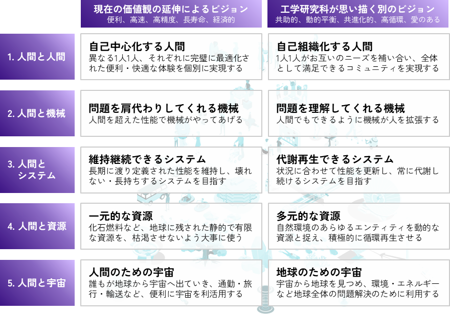

# Tohoku Transition to Future
東北大学工学研究科　プレゼンス向上アクションプラン

## 我々は何を目指すのか
工学研究科では、多様な技術領域の研究者が、様々な問題解決のために世界一線級の研究を続けています。その根底には、「技術の進歩は人の幸せにつながるはずだ」という強い信念があり、多くの素晴らしい成果があげられています。しかし、グローバルな視点に立ったとき、社会を覆っている問題群は、単なる技術の進歩だけで解決することが困難であることも明らかになりつつあります。このような状況の中で工学研究科に求められるのは、先端的な研究の先にある魅力的な社会のビジョンを社会に分かりやすく提示することです。
本プロジェクトでは、近年注目されている[トランジッションデザイン](transitiondesign.html)のコンセプトをベースに工学研究科の未来を考え、そのプロセスを通じてプレゼンスの向上を目指します。

## ビジョン策定タスクフォース活動
2021年度前半には、工学研究科ビジョン策定タスクフォースによる活動を通じて、工学研究科の目指す未来ビジョンを模索してきました。

- [ビジョン策定タスクフォースの活動について](vision_tf.html)

## Tohoku Transition To Future Vision
工学研究科の多様な研究者との共創を通じ、工学研究科が思い描くビジョンを右図の5つの視座に集約しました。

それぞれの視座の中で、2種類の工学研究科が導く未来へのビジョンを結晶化しました。
- **現状の価値観の延伸によるビジョン**
    - 便利さ、快適さ、堅牢さなど、現在良しとされている機能・性能が極限まで進化・拡張した先の社会の姿
    - それは1つの理想像であると同時に、それが我々が本当に目指すべき姿なのだろうかという問いを生み出した
- **工学研究科が思い描く別のビジョン**
    - 上記の問いに応える形で、工学研究科が思い描く、より人道的・調和的な別の社会の姿を提起
この2つのビジョンはどちらかだけが正しいということではなく、未来が一意ではなく様々な方向性・可能性を有しているということを考慮しながら、工学が人間や社会に貢献するための羅針盤になるものです。

### それぞれの視座についての詳細

1. [人間と人間](human.html)
2. [人間と機械](machine.html)
3. [人間とシステム](system.html)
4. [人間と資源](resource.html)
5. [人間と宇宙](space.html)

## 今後の展望
2021年度は文章ベースで骨子となるビジョンコンセプトの策定を行いました。2022年度には、前年度のコンセプトを可視化・映像化することで解像度の高いシナリオを作成します。それによりWebなどを通じてわかりやすく社会にメッセージを発信すると共に、シンポジウム・ワークショップ開催による学生・市民との共創も企画していきます。

