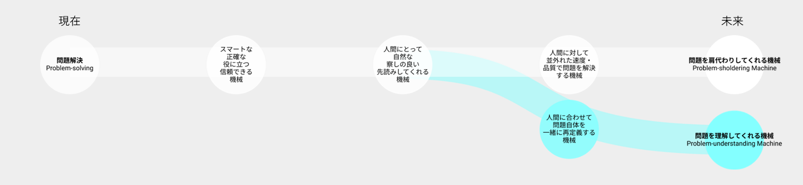

# Vision 2: 人間と機械

機械が人並外れた性能で人間のあらゆる問題を処理できたら、人間と社会はアップデートされるのか？

## 現在の価値観の延伸によるビジョン：問題を肩代わりしてくれる機械

- 技術が、既知の作業や問題を並外れた性能で解決する機械を生み出し、人間の生産活動を代替する
- 機械と人間は異なるエンティティであり、機械は人間と対峙する
- 機械は超常的な性能で人間を置き去りにする
- 機械はノウ・ハウ（Know-How）を極め、与えられたゴールに対して優れた成果を出す

## 工学研究科が思い描く別のビジョン：問題を理解してくれる機械

- 技術が、人間と共に未知の可能性を発見する機械を生み出し、人間のバウンダリを拡張する
- 機械と人間は時に混ざり合うエンティティであり、機械と人間の境界は曖昧になる
- 機械が人間のレベルに合わせる
- 機械はノウ・ワイ（Know-Why）を人間と共に考え、与えられたゴール自体を設定し直す

## 望ましい方向性を考えるために考慮すべきバランス

## 関連する工学研究科の研究分野

| 工学研究科の研究分野  | 研究キーワード   |
|------------------------|-----------------------------------------------------------|
| 半導体・情報通信機器・ハードウェア     | 半導体実装、MEMS、CPS、トライボロジー、無線通信、量子情報、通信ネットワーク、情報通信、光集積回路、マイクログリッド、カーボンナノチューブ、グラフェンナノリボン、機能性有機デバイス、磁性複合材料、スピントロニクス磁気記録、バイオセンサ、化学センサ、メタマテリアル、精密計測・加工、神経模倣回路 |
| ヒューマンインタフェース・サービス     | 音声対話、ディスプレイ、電子ホログラフィ立体表示、ウェアラブルデバイス  |
| 機械学習・人工知能・ソフトウェア   | 画像認識、機械学習、パターン認識、イメージング、AIプロセッサ、自動運転   |
| 人間 - 機械協調・人間拡張・ロボティクス | 人間－機械協調、人間拡張、人間・ロボット協調、デジタルクローン、機械の信頼性・耐久性、IoTセンシング、AIロボット、運動学習、分子ロボティクス、DNAコンピュータ、人工細胞、触覚センサ
                                                          |
