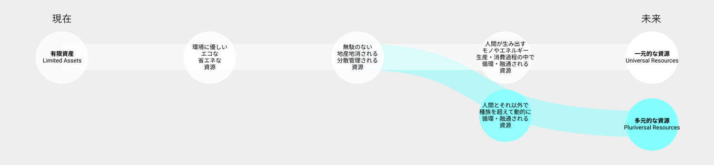

# Vision 4: 人間と資源
限られた資源を枯渇しないよう極限まで節制統制した先に、持続可能な社会が実現されるのか？

## 現在の価値観の延伸によるビジョン：一元的な資源
- 技術が、化石燃料などの地球に残された資源を枯渇させないよう、より経済的で好循環の資源利用方法を生み出す
- 資源は静的で有限なものなので、大事に使わなければならない
- 資源の生産・消費・循環まで全て人間がコントロールする
- 資源は一元的に人間によりコントロールされ、振り分けられる

## 工学研究科が思い描く別のビジョン：多元的な資源
- 技術が、化石燃料以外の新たな資源とその利用方法を生み出す
- 資源は動的で循環するものなので、積極的に循環再生させればよい
- 自然と相互依存しながら、自分の資源は自分でまかなう
- 自然や人間以外のエンティティも資源循環のサイクルに含める

## 望ましい方向性を考えるために考慮すべきバランス

## 関連する工学研究科の研究分野

| 工学研究科の研究分野 | 研究キーワード|
|----|----|
|次世代マテリアル	|材料工学、複合材料、ナノ材料、コーティング、熱電発電材料、太陽電池材料、焦電発電材料、レアメタル分離、植物代謝工学、タンパク質工学、進化分子工学、超臨界流体、抽出分離、循環材料プロセス、廃棄物処理、形状記憶合金、リサイクル、製精錬、鋳造、塑性加工、レアアース、金属生産工学、光触媒、導電性高分子、電気化学トランジスタ、セルロースナノ材料|
|再生可能エネルギー	|再生可能エネルギー、エネルギー変換、太陽エネルギー、振動発電・環境発電、地熱エネルギー、保全工学、エネルギーハーベスティング、マイクログリッド、熱電発電、洋上風力発電|
|熱・電気エネルギー	|超伝導、セラミックス、高熱伝導率材料、エンタングルメント、ホログラフィー、高温超伝導、分子モーター、生物物理、熱発電、ペルチェ冷却素子、分子機械、パワーエレクトロニクス、冶金用コークス、燃焼|
|原子力・量子エネルギー	|原子力材料、放射性廃棄物、新型原子炉、原子力教育、核融合炉材料、放射線検出器、核燃料サイクル、加速器、地層処分環境配慮、核変換、核融合エネルギー、リスク評価、量子情報、量子コンピュータ、放射線計測|
|電池・電源	|燃料電池、軽量材料(アルミニウム、セラミックス等)、リチウムイオン電池、燃料電池、抵抗変化メモリ、スピントロニクス、耐熱材料、鉄鋼材料、全固体電池、二次電池|
|資源循環	|資源循環、炭素循環、CO2、マテリアルフロー解析、ライフサイクル評価、脱炭素、資源変換、水素化脱酸素、バイオマス変換、二酸化炭素資源化、環境化学、エネルギー環境教育、カーボンニュートラル|

