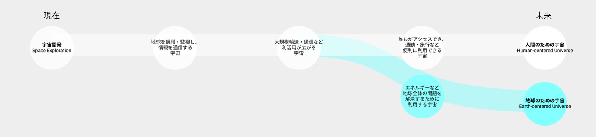

# Vision 5: 人間と宇宙

宇宙の利活用が進み、誰もがアクセスできるようになったら、人間は国境を超えて協調できるのか？

## 現在の価値観の延伸によるビジョン：人間のための宇宙
- 技術が、人間の生産活動や娯楽をより便利・快適にする宇宙利用を生み出す
- より高速な通信やより大量な旅客輸送など、既存の性能を高めることに宇宙を利用する
- 宇宙の利権や競争、領土を奪い合う
- 地球のエネルギーや資源を利用して宇宙を利活用する

## 工学研究科が思い描く別のビジョン：地球のための宇宙
- 技術が、地球全体の問題を解決し、環境を保全する宇宙利用を生み出す
- 新しい物質の発見や素材の開発など、未知の性能を発見することに宇宙を利用する
- 国境を超えて1つしかない地球を保全する
- 地球の自然やエネルギー資源を維持するために宇宙を利活用する

## 望ましい方向性を考えるために考慮すべきバランス

## 関連する工学研究科の研究分野

|工学研究科の研究分野		|研究キーワード|
|----|----|
|航空宇宙材料・構造	|流体力学、航空宇宙工学、超小型人工衛星、大型宇宙構造物、複合材料、流体制御、3Dプリンタ、プラズマ|
|宇宙探査・推進	|宇宙探査、レーザー推進、宇宙電気推進、ビーム推進、電気推進、宇宙ロボット、プラズマアクチュエータ、磁気セイル|
|航空宇宙システム・ガバナンス	|航空交通流、振動発電・環境発電、スペースデブリ、システムインテグレーション|
