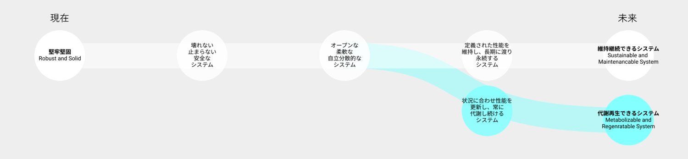

# Vision 3: 人間とシステム

高耐久・長寿命化が進み、超長期的に性能を維持できるシステムは、人間に安心と安全を与えるか？

## 現在の価値観の延伸によるビジョン：維持継続できるシステム

- 技術が、超長期に渡り性能を維持できるシステムを生み出す
- 常に新しい技術、最先端の知識を利用する
- 寿命や耐久性を伸ばす
- 合理化、単純化し、個別最適化を図る

## 工学研究科が思い描く別のビジョン：代謝再生できるシステム

- 技術が、状況に合わせて常に代謝・再生できるシステムを生み出す
- 地元のリソースやその土地の特性、古くからある叡智を利用する
- 柔軟性や拡張性を伸ばす
- 複雑さを受け入れ、全体満足化を図る

## 望ましい方向性を考えるために考慮すべきバランス

## 関連する工学研究科の研究分野

|工学研究科の研究分野	|研究キーワード|
|----|----|
|物流・人流・移動・輸送 | 次世代移動体、ライフサイクルコスト、交通工学 |
|土木インフラ	| グリーンインフラ・アーバニズム、地震工学、コンクリート、耐久性、維持管理、地盤災害、洋上風力基礎、原子力発電、液状化、排水処理、溶接・接合、耐食性、有機無機ハイブリッド材料、積層造形、圧電材料、超電導免震装置|
|住宅・建築 |地産地消型住宅生産、カーボンニュートラル建築、都市建築デザイン、カーボンニュートラル建築、耐震工学、建築構造、人工環境デザイン、耐震性、ZEB、ZEH、建築省エネルギー|
|都市・地域・まちづくり |復興まちづくり、地域計画、 景観まちづくり（アフターコロナ・新エネルギー）、都市緑化、空気環境、都市気候、市街地の風環境、都市農業、ヒートアイランド対策|
|システム保全・マネジメント | インフラマネジメント、空間政治学、スマートシティ、レジリエンスエンジニアリング、エネルギーシステムデザイン、非破壊検査、超音波探触子、弾性表面波センサ|
|農林水産・気候・自然環境 | 富栄養化、干潟、無給餌養殖漁業、水文学、水資源工学、河川工学、水質浄化、自然再生、ノロウイルス、乾燥害、林野火災、気候変動、森-川-海、食品化学、土壌肥料学、ケミカルバイオロジー、環境影響評価、植物科学、地球化学|

