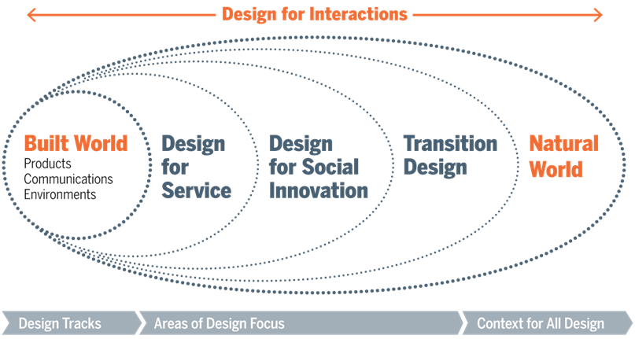

# Transition Design

長期的な望ましい未来を思い描くためのアプローチとして、トランジションデザイン（[Irwin.T, 2015](https://doi.org/10.1080/17547075.2015.1051829)）を用いる。
気候変動、生物多様性の喪失、天然資源の枯渇、貧富の差の拡大など、21世紀のWicked、Problems（複雑な問題）はミクロ〜マクロレベルで様々な問題が絡み合っており、もはや局所的・単一の技術ソリューションでは解決不可能になっている。こうした現状を理解し、望ましい未来を思い描くためには、学際的な専門家の共創、および人間目線（デザイン）による未来の可視化が求められており、トランジションデザインは、社会、経済、自然システムの相互接続性を深く理解し、物語、知識、スキル、行動を開発するための新しい方法論を提案している。
未だ世界でも実践例が少ない中、今回の取り組みではこのトランジションデザインを適用し、工学研究科の多様な研究者の共創によりビジョンを創出する先進的な実践である。

