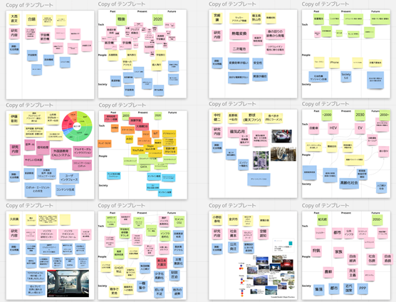

# 2021年度　工学研究科ビジョン策定タスクフォースの活動

## プロセスと体制

トランジションデザインが提案しているSpatio-Temporal Matrix フレームワーク（下図）を議論の土台とし、工学研究科ビジョン策定TFにて共創的に工学研究科のビジョン創出を実施しました。

- 横軸：時間軸（トランジション）
    - 未来を単発の事象ではなく、過去から続く流れ・人間の叡智の蓄積として捉える
- 縦軸：空間軸（ミクロ〜マクロ）
    - 技術そのものの進化・展望だけではなく、それが人間・社会にどのように影響するのかを考える

検討はオンラインホワイトボードMiroを使い、ビジョン策定TFの中で4回の共創作業を実施しました（計9.5h）。

- ビジョン策定TF（敬称略）: 伊藤 彰則, 久田 真, 高橋 信, 岩渕 正樹, 大西 直文, 松山 成男, 山田 博仁, 宮﨑 穰、福島 康裕, 須藤 祐司, 寺田 賢二郎, 小野田 泰明

## 共創セッション: Discussion 第1回@ Miro(5/13 10:00-12:00)

初回として、参加者それぞれの研究分野を時間の流れで整理するとともに、分野ごとに思い描くビジョンの類似点・違いについて考察した。

## 共創セッション: Discussion 第2回@ Miro (7/7 8:30-10時)

人間の普遍的な9つのニーズ（Max-Neef, M. 1989）の概念を導入し、それぞれ個人の研究分野がどのような人間社会のニーズを満たすのか、技術と人間のレイヤーを結びつけて考察・議論した。

## 共創セッション: Discussion 第3回@ Miro (9/2 9-12時)

現在の研究の展望・ビジョン、インパクトを個人個人でアイデア出しを行い、スケッチによる可視化を通じて、それぞれの研究が導く未来像を共有・議論した。また同日、21世紀の日本社会の動向を加味して導出された、ありうる社会の姿を批評的に考察し（バックキャスティング）、工学研究科としてビジョンの検討に不可欠な観点や問いを整理した。

## 共創セッション: Discussion 第4回@ Miro (9/28 9-12時)

議論の取りまとめとして、工学研究科の多様な研究が、どのような社会課題を解消するために存在し、またどのような未来を見据えているのか、参加者それぞれが思い描く未来像を同じ一枚の土台にマッピングした。

共創セッションを通して、工学研究科の多様な研究、および研究者が思い描く未来像が一枚図にマッピングされた。それらは人間を取り巻く、下記の5つの視座に集約された。（詳細はAppendix1参照）

1. 人間と人間
2. 人間と機械
3. 人間とシステム
4. 人間と資源
5. 人間と宇宙

それぞれの視座の中で、研究者が思い描く個別の未来像を集約・結晶化させることで、2種類の工学研究科が導く未来へのビジョンを創出した。
- 現状の価値観の延伸によるビジョン
    - 便利さ、快適さ、堅牢さなど、現在良しとされている機能・性能が極限まで進化・拡張された先にある社会の姿
    - それは1つの理想像であると同時に、それが我々が本当に目指すべき姿なのだろうかという問いを生み出した
- 工学研究科が思い描く別のビジョン
    - 上記の問いに応える形で、工学研究科が思い描く、より人道的・調和的な別の社会の姿を提起した
    - この2つのビジョンはどちらかだけが正しいということではなく、未来が一意ではなく様々な方向性・可能性を有しているということを考慮しながら、工学が人間や社会に貢献するための羅針盤になるものである

